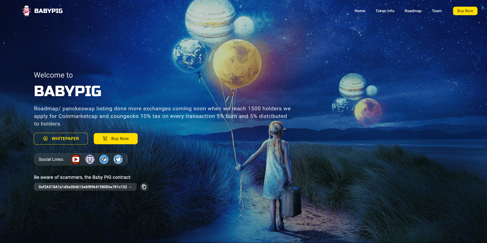

# 🐷 PiggyToken - Crypto Landing Page

[](https://ottomandeveloper.github.io/piggyToken/)
[](https://flutter.dev)
[](LICENSE)

A modern, responsive landing page for PiggyToken cryptocurrency built with Flutter Web. Showcasing tokenomics, roadmap, and community features.



## ✨ Features

- **Responsive Design**: Works on all devices from mobile to desktop
- **Interactive UI**: Smooth animations and transitions
- **Token Information**: Clear display of tokenomics and utility
- **Roadmap Section**: Visual timeline of project milestones
- **Community Links**: Easy access to social channels
- **Light/Dark Mode**: Automatic system preference detection

## 🚀 Live Demo

Experience the live deployment:  
👉 [https://ottomandeveloper.github.io/piggyToken/](https://ottomandeveloper.github.io/piggyToken/)

## 🛠️ Technical Stack

- **Framework**: [Flutter 3.x](https://flutter.dev) (Web)
- **State Management**: Provider
- **UI Components**: Custom design with Flutter widgets
- **Animation**: Flutter animations package
- **Deployment**: GitHub Pages

## 🖥️ Local Development

### Prerequisites

- Flutter SDK 3.27.0+
- Dart SDK 3.6.0+
- Chrome (for web testing)

### Setup

```bash
# 1. Clone repository
git clone https://github.com/OttomanDeveloper/piggyToken.git
cd piggyToken

# 2. Install dependencies
flutter pub get

# 3. Run development server
flutter run -d chrome
```
